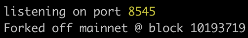
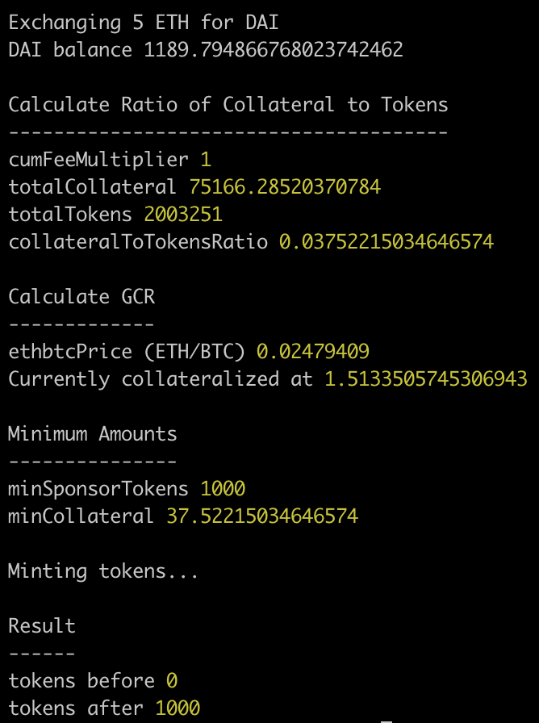

# Example

# Usage

1. Clone this repo.

2. Run `npm install` at project root.

3. Create a `.env` file with the following content:

   ```
   MAINNET_NODE_URL=https://mainnet.infura.io/v3/<infura key>
   PRIV_KEY=<any private key>
   ```

4. Run `npm run chain` to start a local test-chain forked off of mainnet state.

5. Run `npm start` to trigger the script.

# Chain output



# Script output


